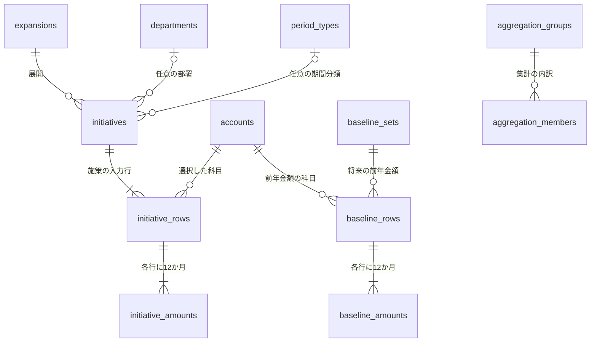

# Triadichromeの明細と保存構造

この文書は、明細画面と将来の拡張に向けた保存構造の設計である。
製品の操作と計算の要件は[REQUIREMENTS.md](REQUIREMENTS.md#明細)、実装済みの保存形式は[README](README.md#保存形式の方針)を正本とする。
施策・入力行・月別金額と明細画面は形式バージョン10で実装している。前年合計値・将来の実績と版管理は拡張設計であり、未実装である。
互換性のため、一計画の参照 `budget_id` と年月の参照用 `periods` を残す。月別金額の正本は `initiative_amounts` とし、`details` は旧集計用の読み取りビューである。

## 元データと画面の関係

金額の正本は、入力行と月に対応する一件の金額とする。
施策に共通する情報、入力行に共通する情報、月別の情報を別の表に保存し、変更されない識別キーで結び付ける。
同じ内容を一か所に保存して参照する分け方を、ここでは**正規化**と呼ぶ。
名前を変更しても対応が切れず、同じ科目を使う別行へ変更が広がらない構造になる。

明細画面は、これらの表を結合した読み取り用の表現とする。
施策名や科目名が明細の各行に繰り返し見えても、保存する名称は施策やマスタの一か所だけである。
編集は結合結果を丸ごと書き戻さず、列の所有者と識別キーに応じた専用の更新処理へ渡す。

各表の数字を再現するための入力は、月別金額に加えて、科目属性、集計の所属と符号、表示順、施策の分類、将来の前年金額である。
フィルター済みの明細や、名称と金額だけの平らな一覧を保存の正本にはしない。
分類や集計の関係を失うと、同名の行の区別や総原価表の小計を再現できないためである。



図の前年金額用の表は、施策とは異なる種類の金額を追加する際の設計である。
前年金額の入力方法や実績管理を、今回の設計だけで実装対象へ追加しない。

## 保存する単位と識別キー

一つの専用ファイルが一つの計画を持つ現行の境界を維持する。
計画の作成日時などは一件の計画情報で管理し、全明細に同じ計画識別子を繰り返し持たせない。
複数計画や共有編集が必要になった場合は、その要件に合わせて別途拡張する。

| 表 | 一件の意味 | 所有する値 | 重複を防ぐ条件 |
|---|---|---|---|
| `initiatives` | 一つの施策 | 名称、施策備考、年度、展開、部署、期間分類、登録順 | 計画内の施策名が一意 |
| `initiative_rows` | 施策入力の一つの科目行 | 施策への参照、科目への参照、入力行順 | 科目の重複は許可 |
| `initiative_amounts` | 一つの入力行の一月分 | 入力行への参照、固定の月、金額 | 入力行と月の組が一意 |
| 各マスタ | 一つの選択肢 | コード、名称、属性、マスタ固有の設定 | 現行の重複禁止条件を維持 |
| 集計の定義と所属 | 一つの集計と、その内訳 | 表示名、親子関係、加減算、表示順 | 対象の重複所属と循環を禁止 |

施策ID、入力行ID、月別金額IDは別の識別キーとし、名称、科目コード、表示行番号をキーに使わない。
フィルター、並べ替え、年度変更、科目変更でも各IDを保つ。
将来削除操作を設ける場合も、削除したIDを別のデータに再利用しない。
ファイル間でのIDの一致は同一データを意味しない。

画面の列定義には、列ID、表示名、値の型、編集可否、更新対象の種類、フィルター方法、比較方法を持たせる。
編集対象のIDは表示位置から逆算せず、読み取り結果と一緒に保持する。
前年度金額も結合する将来の明細では、種類とIDの組を画面の行キーにする。

## 固定の月と年度

各入力行の月別金額を、4月から翌3月までの12件として保存する。
月の値は1から12で固定し、施策の年度から暦年を求める。

```text
暦年 = 施策の年度 + (月が1〜3なら1、それ以外は0)
年度内の表示位置 = (月 + 8) % 12
```

月別金額に年度や年月の参照を重複保存しない。
この構造なら、施策の年度を変更する処理は施策の年度一件を更新し、全明細の年月は同じ規則から求め直せる。
12か月の金額、月、明細IDは変わらない。
複数年度を持つ施策が将来必要になった場合は、施策と入力行の間に年度単位の表を追加し、その単位へ年度と入力行を移す。
現時点で未指定の複数年度機能は導入しない。

新規登録時に12件をまとめて生成し、空欄の金額を0で補完する。
金額を消す編集も、明細を削除せず0への更新として扱う。
登録前の未選択の入力行や日本語変換中の文字列は、保存済み明細とは分けた入力状態で保持する。

月の範囲と重複禁止はSQLiteの制約で守る。
「12件がすべて揃う」という条件は、複数行にまたがるため、保存処理と読込時の検証で確認する。
件数が12で、月が1から12に限定され、月の重複がなければ、全月が揃っていると判定できる。
作成途中の1件から11件を含むコピーを、保存や画面の正本として公開しない。

## 金額の精度

入力と表示は、現行の千円単位、小数点以下3桁を維持する。
新構造の保存と加減算は、1円単位の整数で行う。
例えば画面の`1.234`千円は`1234`円として保存し、表示時に千円へ変換する。
整数を使う理由は、SQLiteの浮動小数点数が近似値であり、十進数の金額を常に正確に表せるものではないためである。[SQLiteの浮動小数点数の説明](https://www.sqlite.org/floatingpoint.html)

JavaScriptで正確に扱える整数の範囲に、保存金額と計算途中の金額を制限する。
文字列入力を十進数として解析して整数へ変換し、1円未満の入力や範囲外の入力を丸めて受け入れない。
範囲を超える合計は、保存値が正常でも計算失敗として扱う。
利益率は金額とは別の計算結果とし、表示する段階で要件の桁数へ丸める。

0は有効な金額であり、空欄と入力済みの0は保存上区別しない。
属性未設定、集計未設定、前年データ未登録、利益率のゼロ除算は、金額0とは別の状態として持つ。
入力行の0補完を理由に、未登録の前年データを登録済みと扱ったり、計算できない結果を0に置き換えたりしない。

## SQLiteの中核となる定義案

次は中核3表と読み取りビューの定義案である。
参照先のマスタは別途存在する前提とし、現行ファイルにそのまま実行する移行SQLにはしない。
コードや名称の検証は各マスタに置く。
既存形式の未設定項目を読み取る対応と、新規登録に必要な条件は移行節に従う。

```sql
CREATE TABLE initiatives (
  id INTEGER PRIMARY KEY AUTOINCREMENT,
  name TEXT NOT NULL UNIQUE CHECK (length(trim(name)) > 0),
  note TEXT NOT NULL DEFAULT '',
  fiscal_year INTEGER NOT NULL
    CHECK (typeof(fiscal_year) = 'integer' AND fiscal_year BETWEEN 1 AND 9998),
  expansion_id INTEGER REFERENCES expansions(id) ON DELETE RESTRICT,
  department_id INTEGER REFERENCES departments(id) ON DELETE RESTRICT,
  period_type_id INTEGER REFERENCES period_types(id) ON DELETE RESTRICT,
  sort_order INTEGER NOT NULL CHECK (sort_order >= 0),
  revision INTEGER NOT NULL DEFAULT 0 CHECK (revision >= 0)
);

CREATE TABLE initiative_rows (
  id INTEGER PRIMARY KEY AUTOINCREMENT,
  initiative_id INTEGER NOT NULL REFERENCES initiatives(id) ON DELETE RESTRICT,
  account_id INTEGER NOT NULL REFERENCES accounts(id) ON DELETE RESTRICT,
  sort_order INTEGER NOT NULL CHECK (sort_order >= 0),
  revision INTEGER NOT NULL DEFAULT 0 CHECK (revision >= 0)
);

CREATE TABLE initiative_amounts (
  id INTEGER PRIMARY KEY AUTOINCREMENT,
  row_id INTEGER NOT NULL REFERENCES initiative_rows(id) ON DELETE RESTRICT,
  month INTEGER NOT NULL
    CHECK (typeof(month) = 'integer' AND month BETWEEN 1 AND 12),
  amount_yen INTEGER NOT NULL DEFAULT 0
    CHECK (typeof(amount_yen) = 'integer'
      AND amount_yen BETWEEN -9007199254740991 AND 9007199254740991),
  revision INTEGER NOT NULL DEFAULT 0 CHECK (revision >= 0),
  UNIQUE (row_id, month)
);

CREATE INDEX initiatives_year_idx ON initiatives(fiscal_year, sort_order, id);
CREATE INDEX initiative_rows_owner_idx ON initiative_rows(initiative_id, sort_order, id);
CREATE INDEX initiative_rows_account_idx ON initiative_rows(account_id);
CREATE INDEX initiatives_expansion_idx ON initiatives(expansion_id);
CREATE INDEX initiatives_department_idx ON initiatives(department_id);
CREATE INDEX initiatives_period_type_idx ON initiatives(period_type_id);

CREATE VIEW initiative_detail_view AS
SELECT
  m.id AS detail_id,
  r.id AS row_id,
  i.id AS initiative_id,
  i.name AS initiative_name,
  i.note AS initiative_note,
  i.fiscal_year,
  i.fiscal_year + CASE WHEN m.month < 4 THEN 1 ELSE 0 END AS calendar_year,
  m.month,
  (m.month + 8) % 12 AS fiscal_month_position,
  i.expansion_id,
  i.department_id,
  i.period_type_id,
  r.account_id,
  a.code AS account_code,
  a.name AS account_name,
  a.attribute AS account_attribute,
  m.amount_yen,
  CASE a.attribute
    WHEN 'sales' THEN m.amount_yen WHEN 'cost' THEN -m.amount_yen
    WHEN 'expense' THEN 0 WHEN 'profit' THEN 0 END AS sales_effect_yen,
  CASE a.attribute
    WHEN 'sales' THEN m.amount_yen WHEN 'cost' THEN -m.amount_yen
    WHEN 'expense' THEN -m.amount_yen WHEN 'profit' THEN m.amount_yen END AS profit_effect_yen,
  i.sort_order AS initiative_order,
  r.sort_order AS row_order,
  i.revision AS initiative_revision,
  r.revision AS row_revision,
  m.revision AS detail_revision
FROM initiative_amounts m
JOIN initiative_rows r ON r.id = m.row_id
JOIN initiatives i ON i.id = r.initiative_id
JOIN accounts a ON a.id = r.account_id;
```

新規施策の展開名は必須とし、更新処理でも必須条件を検証する。
SQLの`expansion_id`は旧形式の未割り当てを保護するためNULLを許容する。
NULLを新規登録で使える選択肢にはしない。
科目の属性未設定も、旧形式を表示するために保持し、新規選択や金額更新の前に設定を要求する。

外部キーは、参照先の存在を保証するSQLiteの制約である。
各接続で`PRAGMA foreign_keys = ON`を設定し、export後などの再接続でも有効化する。
使用中のマスタ削除には`RESTRICT`を使い、金額が連鎖削除される定義を避ける。[SQLiteの外部キーの説明](https://www.sqlite.org/foreignkeys.html)
型の宣言だけに依存せず、月と金額には実際の値の型も確認する条件を置く。[SQLiteの値の型](https://www.sqlite.org/datatype3.html)

## 列の編集と変更範囲

| 編集列 | 更新する正本 | 対象となるキー | 連動する範囲 |
|---|---|---|---|
| 施策名、施策備考 | `initiatives` | 施策ID | 同じ施策の全入力行、全月 |
| 年度 | `initiatives` | 施策ID | 同じ施策の全明細の年月 |
| 展開名、部署名、期間名 | `initiatives`のマスタ参照 | 施策ID | 同じ施策の全入力行、全月 |
| 科目コード、科目名 | `initiative_rows.account_id` | 入力行ID | 同じ入力行の12か月 |
| 金額 | `initiative_amounts.amount_yen` | 月別金額ID | その一件 |
| 月、科目属性、売上への影響額、利益への影響額 | 直接更新しない | 固定値または計算結果 | 正本の変更から再計算 |

科目コードと科目名は、同じ科目を選ぶための二つの表示列である。
これらの編集でマスタを改名せず、登録済みの科目へ入力行を付け替える。
施策IDと入力行ID自体の変更、別施策への明細の移動、行の追加や削除は明細の編集命令に用意しない。

更新命令は、例えば`updateInitiativeField`、`changeRowAccount`、`updateDetailAmount`のように所有者ごとに分ける。
フィルター後の行番号、選択中の科目ID、施策名で更新対象を検索しない。
更新対象の存在、所属、必須項目、重複、金額精度を検証し、不正な変更を確定しない。
同じ科目の別入力行や、別施策に属する行は更新対象に含めない。

科目などの変更で複数行に表示上の影響があるときは、編集対象の近くにその範囲を示す。
全件に確認ダイアログを増やすことはせず、入力内容を保ったまま、保存結果と失敗理由を対象の近くへ示す。

## 保存の確定と競合

画面の入力中の値、最後に保存できたデータ、保存処理中のコピーを分ける。
保存対象のコピー上で検証と更新を行い、関連する変更を一つのSQLiteトランザクションにまとめる。
トランザクションは、複数の更新をまとめて成功または取消にする仕組みである。
SQLite内の成功と実ファイルの書き込み成功は別の段階であり、ファイルの書き込みが完了するまで保存済みの画面状態を置き換えない。

`revision`は、その保存対象が何回更新されたかを表す整数とする。
命令には編集開始時の施策、入力行、明細の該当するrevisionを付け、直列化した保存処理が最新の状態と照合する。
親の科目や年度が編集開始後に変わっていた場合も、古い前提の命令をそのまま上書きしない。
これは同じ画面内の保存待ちを検出する仕組みであり、外部アプリとの共有編集を保証するものではない。

ファイル境界では現行の外部変更確認を維持し、書き込み直前のファイルと最後に保存した内容が異なれば上書きを止める。
この確認だけで、確認と書き込みの間に起きる外部更新を完全に防ぐことはできない。
同時編集機能を将来設ける場合は、ロックや競合解決の要件を別途定める。
キャンセルや書き込み失敗では保存済みのデータと未保存の入力を保ち、再試行はその時点の最新の正本へ検証して適用する。

## 前年金額の拡張

前年の科目別金額は、施策の増減とは異なる正本として管理する。
前年年度の施策の増減を、前年の科目別合計値として代用しない。

| 将来追加する表 | 一件の意味 | 一意な組 |
|---|---|---|
| `baseline_sets` | ある計画年度に使う前年金額の一組 | 対象の計画年度 |
| `baseline_rows` | 前年金額の一つの科目行 | 前年金額の組IDと科目ID |
| `baseline_amounts` | 前年金額の科目行の一月分 | 前年科目行IDと月 |

前年科目行も、登録した行には12件の整数金額を持たせる。
対象計画年度を`F`とすると、前年の暦年は4月から12月が`F - 1`、1月から3月が`F`である。
対象計画年度と出典の年月を読み取り結果で区別する。
科目行が未登録の状態と、登録済みの12か月がすべて0の状態も区別する。

統合明細では、データ種別、対象計画年度、出典の年月、科目、金額、元の行キーを持ち、施策増減と前年金額を種類付きで並べる。
前年行に架空の施策を作ったり、部署や展開名を推測して割り当てたりしない。
前年行の編集可能列と入力方法は、その機能を実装するときに決める。
前年行の追加だけで施策用の編集処理が適用されないよう、行の種類ごとに編集命令を分ける。

## 各ビューの再現と計算定義

| 表示 | 使用する正本 | 計算または整形 |
|---|---|---|
| 施策入力 | 施策、入力行、月別金額 | 月を横へ並べる |
| 明細 | 同じ正本と各マスタ | 月を縦へ並べ、名称と影響額を結合する |
| 施策一覧 | 同じ月別金額と科目属性 | 施策と月ごとの売上、利益を計算する |
| 展開表 | 施策一覧と同じ結果、展開マスタ、将来の前年金額 | 展開ごとの小計と全体合計を計算する |
| 総原価表 | 同じ月別金額、将来の前年金額、科目順、集計定義 | 科目と月で合算し、集計定義を適用する |

総原価表の小計、展開表の小計、利益率を更新可能な保存値にしない。
科目属性による影響額と、集計マスタの加減算は異なる計算規則であり、両方の符号を重ねて適用しない。
任意の集計設定で総原価表の集計と科目属性による利益が一致するとは限らない。
同じ正本から各表の定義どおりに再現できることと、異なる定義の結果が常に同額であることを区別する。
計算規則そのものを統一する変更は、別途合意して行う。

金額計算は`core/`の共通処理に集め、画面は表示用に整形する。
SQLビューにも計算式を置く場合は、同じ入力とマスタから共通処理と一致することを検証する。
空の集計、循環、未設定属性、範囲外の合計は正常な0として扱わない。
フィルターと画面上のソートは読み取り結果だけに適用し、他の表の計算対象や保存順を変えない。

## 機能追加時の分け方

新しい項目は、その値が共通になる範囲へ追加する。
施策全体に一つなら施策へ、入力行ごとなら入力行へ、月ごとなら月別金額へ置く。
一つの施策に複数の分類を割り当てる要件が生じた場合は、その分類との対応表を追加する。
業種の割り当てはまだ合意された機能ではないため、既存の業種マスタがあるという理由だけで施策へ追加しない。

通常の業務項目を「項目名と値」の万能表やJSONへ詰め込まず、型と参照先を持つ列や専用表として増やす。
保存データの意味と制約をSQLite上で確認でき、フィルターや集計でも型を維持できるためである。
利用者が任意項目を定義する機能が必要になった場合に限り、その項目定義、型、対応先を設計する。

将来の実績値や計画の複数版は、必要な単位が決まってから独立した表や版への参照で追加する。
月別金額に用途不明の予備列を増やさない。
その場合も、施策、入力行、月別金額の識別キーと、元データから計算する原則を維持する。

読込、保存、移行の入口には形式バージョンごとの処理を置き、通常の画面に旧形式の分岐を散らさない。
新形式の定義、読込検証、更新命令、移行処理、ビューの契約を対応させて更新する。
未知の新形式を推測して保存せず、対応する版で開くことを案内する。

## 形式バージョン9以前からの移行

形式バージョン9以前は、入力済みの月だけを`details`に保存し、施策と科目への参照を入力行と明細の両方に持つ。
計画の売上と利益はビューで再計算しているが、元テーブルには計算結果用の列も存在する。
新構造への移行では、重複参照の整合性を先に確認し、入力行への参照から施策と科目を一意にたどれる形へ変える。

1. 元のバイト列を維持し、コピー上で形式、参照、入力行の所属、年度、月の重複を検査する。
2. 一意に対応が分かる施策ID、入力行ID、明細IDを維持して写す。新たに補完する月だけに新しい明細IDを採番する。
3. 空欄だった月を0で補完し、12件が揃うことを検査する。空欄と0の区別がなくなることを移行の案内に明記する。
4. 計画金額を円の整数へ変換する。1円未満や範囲外の旧金額を無断で丸めず、該当データの移行を止めて理由を示す。
5. 旧形式の実績値、明細備考、計算結果用の保存値、旧年月IDとの対応を、元の値を持つ専用の移行保全表へ保持する。現在の計画集計には混ぜない。
6. 外部キー、12か月、識別キー、マスタ、件数、科目別金額、施策別の影響額を検証する。比較は各形式の計算定義と金額精度を考慮する。
7. 新形式の検証が成功したコピーだけを書き込み、ファイル保存の完了後に新構造へ切り替える。

旧形式の同一月に複数の明細があり、入力行のキーがない場合は、別行か重複かを金額や科目から推測してまとめない。
年度未設定や複数年度にまたがる施策も、合意なしに年度を付けたり施策を分割したりしない。
対応が決められないファイルは元形式での表示と値の保持を優先し、新構造への保存を止める。
この場合の修復操作は、対象データを確認してから設計する。

移行保全表は通常の編集や集計から分離し、元の値と新IDとの対応を検査可能な形で持つ。
実績機能を将来追加するときに、保全値の意味と移行先を確認して扱う。
保全表を黙って削除する期限は設けず、保存先は同じ専用ファイルとし、外部送信しない。

新しい保存形式への移行は、旧アプリで読めなくなる可能性を含む互換性変更である。
形式バージョン10はアプリ2.0.0以降で扱う。旧形式はコピー上で読み取り用に移行し、元ファイルを書き換えない。初回保存では別名の保存先を選択し、同じファイルへの保存を拒否する。自動保存の場合は「保存を再試行」から保存先を選ぶ。
移行保全表 `legacy_detail_payloads` には旧値を保持し、新形式の編集で消去しない。

## 検証する条件

| 対象 | 確認する利用時の結果 |
|---|---|
| 別入力行の同じ科目 | 一方の科目や金額を変えても、もう一方が変わらない |
| 年度変更 | 施策の全明細の年月だけが移り、明細ID、月、金額は保たれる |
| 空欄と0 | 全入力行に12件を保存し、金額を消しても件数が減らない |
| マスタ変更 | IDを保ち、名称と計算が更新され、使用中の項目を削除できない |
| 表の再現 | 同じ正本と計算定義から各表を再構築できる |
| 保存失敗と競合 | 元ファイル、保存済みデータ、未保存の入力を保護する |
| フィルターとソート | 表示だけが変わり、保存順や他の表の合計は変わらない |
| 旧形式 | 金額、識別キー、実績値、備考を失わず、対応不明な値を推測しない |
| 精度と上限 | 1円単位で計算でき、範囲外の入力や計算を成功扱いにしない |

このSQL案の実行確認は、定義の構文と基本的な制約を確認するものに限る。
ファイル移行、画面操作、12か月を維持する保存処理は、実装時に別途検証する。
